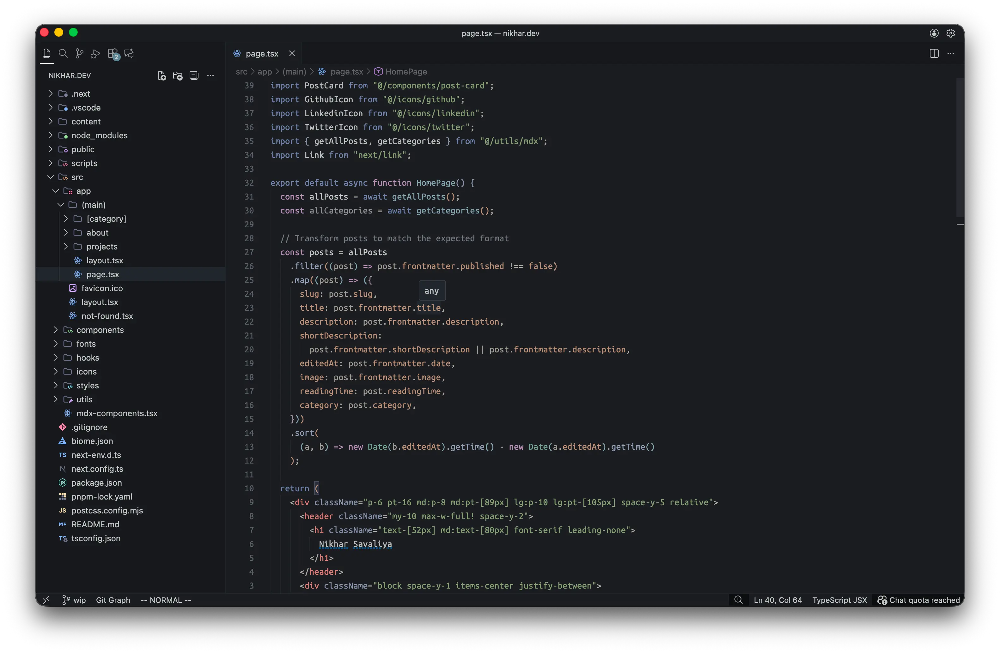

<div align="center">
  <h1>🏔️ Kāshi 🏔️</h1>
</div>

<div align="center">
  <p> Kashi is a dark VS Code theme designed with muted colors, steady contrast, and a quiet UI. 
    <br/>
  It avoids neon saturation and keeps syntax readable without visual noise. 
  The result is a theme that feels calm, balanced, and <em>comfortable</em> for long hours of work.
  </p>
</div>

<p align="center">
    <a href="https://github.com/nikharso/kashi/stargazers"></a>
    <a href="https://marketplace.visualstudio.com/items?itemName=nikharso.kashi"></a>
    <a href="https://marketplace.visualstudio.com/items?itemName=nikharso.kashi"></a>
    <a href="https://buymeacoffee.com/nikharso"></a>
</p>

<!-- <div align='center'>
  
</div> -->
<br/>

<div align='center'>
  
</div>

my preferred settings for fonts is,
```json
{
  "editor.fontFamily": "UbuntuMono Nerd Font",
  "editor.fontSize": 15,
  "editor.lineHeight": 1.45,
  "editor.letterSpacing": 0.2,
}
```

## Features

* 🎨 **Muted, balanced syntax colors** with soft contrast
* 🧩 **Clean UI elements** with minimal borders and distractions
* 🔍 **Clear bracket matching**, selections, and line highlights
* 🌿 **Subtle Git decorations** for added/modified/deleted states
* 🖥️ **Terminal + panel colors** matched to the main palette
* 🌙 **Comfortable in low-light** and long coding sessions

## Color Palette

| Color Name      | Hex                   | Usage Example                 |
| --------------- | --------------------- | ----------------------------- |
| 🌸 Pink         | `#B190B4`             | Strings, parameters           |
| 🔥 Red (Danger) | `#c65b67`             | Errors, invalid tokens        |
| 🍁 Red (Chill)  | `#d4807a`             | Keywords, operators           |
| 🍊 Orange       | `#FAB387`             | Numbers, constants            |
| 🍌 Banana       | `#C4B28A`             | Functions, definitions        |
| ⭐ Strong Banana | `#e6c384`             | Highlights / emphasis         |
| 🔵 Blueish      | `#7483a8`             | Types, interfaces             |
| 🌊 Tealish      | `#7aa89f`             | Imports / support syntax      |
| 🌱 Green        | `#8ba078`             | Git add / success cues        |
| 📝 Foreground   | `#bdc1bf`             | Main text                     |
| 💬 Muted/Subtle | `#aca9a1` / `#75797F` | Comments, low-priority tokens |

## Installation

1. Open **Extensions** in VS Code
   (`Ctrl+Shift+X` / `Cmd+Shift+X`)
2. Search for **Kashi**
3. Click **Install**
4. Go to:
   **File → Preferences → Color Theme**
   and select the **Kashi** theme

## Contributing

- Color suggestions, adjustments, and PRs are welcome.
- If something feels off or unreadable, open an issue - themes get better through iteration.


## Support My Work

If you enjoy using Kashi and want to support continued updates, improvements, and new themes, you can support me here:

<p align="left">
  <a href="https://buymeacoffee.com/nikharso">
    
  </a>
</p>